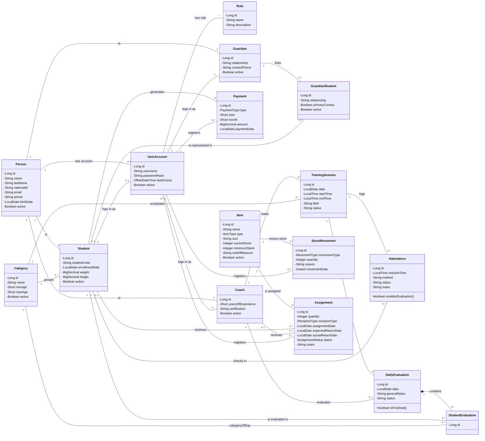

# Diagrama de clases

**Sistema:** SGED — Escuela Deportiva ProFútbol
**Notación:** UML, Mermaid `classDiagram` (misma notación que
`docs/requisitos/casos-uso.md`, versionable como texto y revisable en un
pull request).

Resuelve D-01 (informe de evaluación de calidad): el repositorio
documentaba la arquitectura con el modelo C4 y el MER, pero ninguno de los
dos sustituye a un diagrama de clases — el nivel L3 de C4 describe
componentes de despliegue (controlador/servicio/repositorio como bloques),
no la estructura estática con atributos, operaciones y multiplicidades que
pide esta vista.

**Nota sobre `deportivo`:** los nombres de clase y atributo de ese
dominio (`Coach`, `Category`, `TrainingSession`, `Attendance`,
`DailyEvaluation`, `StudentEvaluation`) están traducidos al inglés en
este diagrama por completitud documental, pero el código Java real de
`deportivo` todavía usa los nombres en español (`Entrenador`, `Categoria`,
`SesionEntrenamiento`, `Asistencia`, `EvaluacionDiaria`,
`EvaluacionEstudiante`) — ese renombrado de código es un trabajo aparte,
pendiente de reparto con el equipo. Este diagrama refleja el diseño
objetivo, no necesariamente el estado exacto del código a la fecha.

## Alcance

Cubre los agregados mínimos de los cuatro dominios que pide la guía:
**Person, UserAccount y Role** (seguridad); **Student, Guardian y
Payment** (académico); **Coach, Category, TrainingSession,
Attendance y DailyEvaluation** (deportivo — nombres traducidos solo en
este diagrama; el código Java de `deportivo` sigue en español, pendiente
de reparto con el equipo); **Item,
StockMovement y Assignment** (inventario). Se agregan
**GuardianStudent** (la clase de asociación real entre Guardian y
Student — sin ella la relación \*-a-\* no se puede dibujar con fidelidad)
y **StudentEvaluation** (el detalle por jugador dentro de una
DailyEvaluation).

Quedan fuera, a propósito, los catálogos de apoyo (`GeneralStatus`,
`Posicion`, `Especialidad`, `Horario`, `Lesion`, `AuditLog`,
`Consent`, `Notification`, `CriterioEvaluacion`,
`DetalleEvaluacion`): añadirlos no cambia la estructura del dominio y
harían el diagrama ilegible. Están documentados en
`docs/basedatos/DATA-DICTIONARY.md`.

Las clases son entidades JPA: cada atributo privado ya tiene su
getter/setter público generado por Lombok (`@Getter @Setter`), así que
listarlos uno a uno no aportaría información — no se muestran. Las únicas
operaciones que se listan son las dos que sí tienen comportamiento propio
más allá de acceso a datos: `Attendance.enablesEvaluation()` y
`DailyEvaluation.isFinished()` (en el código real, todavía
`Asistencia.habilitaEvaluacion()` / `EvaluacionDiaria.estaFinalizada()`
hasta que se traduzca `deportivo`).

## Diagrama

## Notas de fidelidad

- **Enumeraciones.** `Payment.type` (`MEMBRESIA`/`DIARIO`), `Item.type`
  (`UNIFORME`/`BALON`/`IMPLEMENTO`/`OTRO`),
  `StockMovement.movementType` (`ENTRADA`/`SALIDA`/`AJUSTE`),
  `Assignment.recipientType` (`ESTUDIANTE`/`ENTRENADOR`) y
  `Assignment.status` (`ASIGNADO`/`DEVUELTO`/`PERDIDO`) son enums Java
  (`@Enumerated(EnumType.STRING)`), no texto libre. Los valores del enum
  no se tradujeron junto con el resto del código.
- **`Person`–`UserAccount` y `Person`–`Student` son `0..1` por regla de
  negocio, no por restricción de base de datos.** El código JPA declara
  ambas relaciones como `@ManyToOne` simple, sin `unique = true`; es
  `UserAccountService`/`StudentAccessService` quien impide en tiempo de
  ejecución que una persona tenga más de una cuenta o ficha de estudiante
  activa a la vez (ver `UserAccountService.validateRoleCoherent`,
  `StudentAccessService.validateConsistencyWithStudentRecord`).
  Distinto de `Coach`/`Guardian`, donde el `1..1` con Person y
  UserAccount sí lo impone la columna `unique = true` de la migración.
- **`Assignment` es XOR, no una relación libre con ambas puntas.** Exactamente
  una de `student`/`coach` va poblada según `recipientType`; la
  base de datos lo exige con un `CHECK` (migración V15), no el modelo de
  objetos.
