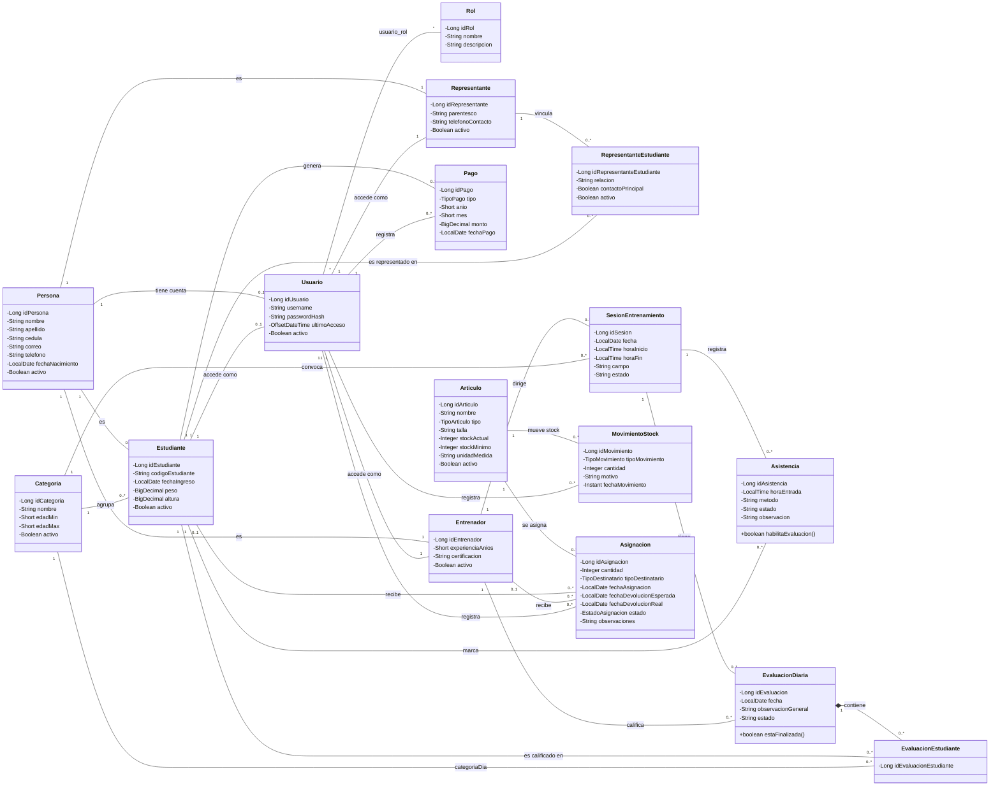

# Diagrama de clases

**Sistema:** SGED — Escuela Deportiva ProFútbol
**Notación:** UML, Mermaid `classDiagram` (misma notación que
`docs/requisitos/casos-uso.md`, versionable como texto y revisable en un
pull request).

Resuelve D-01 (informe de evaluación de calidad): el repositorio
documentaba la arquitectura con el modelo C4 y el MER, pero ninguno de los
dos sustituye a un diagrama de clases — el nivel L3 de C4 describe
componentes de despliegue (controlador/servicio/repositorio como bloques),
no la estructura estática con atributos, operaciones y multiplicidades que
pide esta vista.

## Alcance

Cubre los agregados mínimos de los cuatro dominios que pide la guía:
**Persona, Usuario y Rol** (seguridad); **Estudiante, Representante y
Pago** (académico); **Entrenador, Categoria, SesionEntrenamiento,
Asistencia y EvaluacionDiaria** (deportivo); **Articulo, MovimientoStock y
Asignacion** (inventario). Se agregan **RepresentanteEstudiante** (la
clase de asociación real entre Representante y Estudiante — sin ella la
relación \*-a-\* no se puede dibujar con fidelidad) y
**EvaluacionEstudiante** (el detalle por jugador dentro de una
EvaluacionDiaria).

Quedan fuera, a propósito, los catálogos de apoyo (`EstadoGeneral`,
`Posicion`, `Especialidad`, `Horario`, `Lesion`, `Auditoria`,
`Consentimiento`, `Notificacion`, `CriterioEvaluacion`,
`DetalleEvaluacion`): añadirlos no cambia la estructura del dominio y
harían el diagrama ilegible. Están documentados en
`docs/basedatos/DATA-DICTIONARY.md`.

Las clases son entidades JPA: cada atributo privado ya tiene su
getter/setter público generado por Lombok (`@Getter @Setter`), así que
listarlos uno a uno no aportaría información — no se muestran. Las únicas
operaciones que se listan son las dos que sí tienen comportamiento propio
más allá de acceso a datos: `Asistencia.habilitaEvaluacion()` y
`EvaluacionDiaria.estaFinalizada()`.

## Diagrama

## Notas de fidelidad

- **Enumeraciones.** `Pago.tipo` (`MEMBRESIA`/`DIARIO`), `Articulo.tipo`
  (`UNIFORME`/`BALON`/`IMPLEMENTO`/`OTRO`),
  `MovimientoStock.tipoMovimiento` (`ENTRADA`/`SALIDA`/`AJUSTE`),
  `Asignacion.tipoDestinatario` (`ESTUDIANTE`/`ENTRENADOR`) y
  `Asignacion.estado` (`ASIGNADO`/`DEVUELTO`/`PERDIDO`) son enums Java
  (`@Enumerated(EnumType.STRING)`), no texto libre.
- **`Persona`–`Usuario` y `Persona`–`Estudiante` son `0..1` por regla de
  negocio, no por restricción de base de datos.** El código JPA declara
  ambas relaciones como `@ManyToOne` simple, sin `unique = true`; es
  `UsuarioService`/`EstudianteService` quien impide en tiempo de ejecución
  que una persona tenga más de una cuenta o ficha de estudiante activa a
  la vez (ver `validarRolCoherente`, `validarCoherenciaConFichaEstudiante`).
  Distinto de `Entrenador`/`Representante`, donde el `1..1` con Persona y
  Usuario sí lo impone la columna `unique = true` de la migración.
- **`Asignacion` es XOR, no una relación libre con ambas puntas.** Exactamente
  una de `estudiante`/`entrenador` va poblada según `tipoDestinatario`; la
  base de datos lo exige con un `CHECK` (migración V15), no el modelo de
  objetos.
