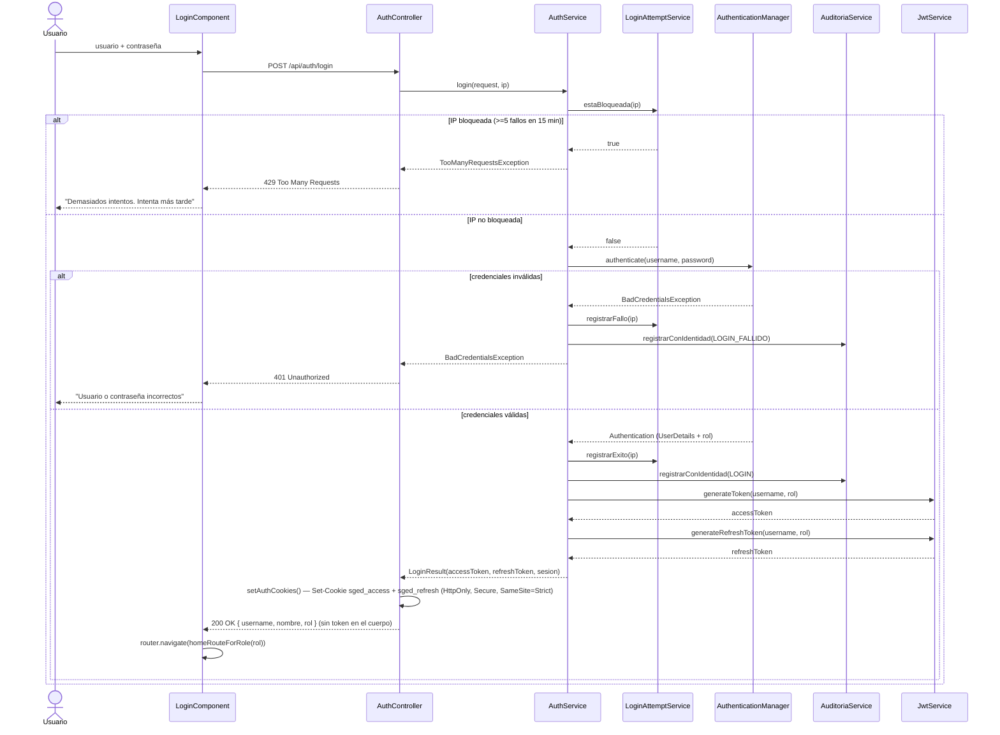
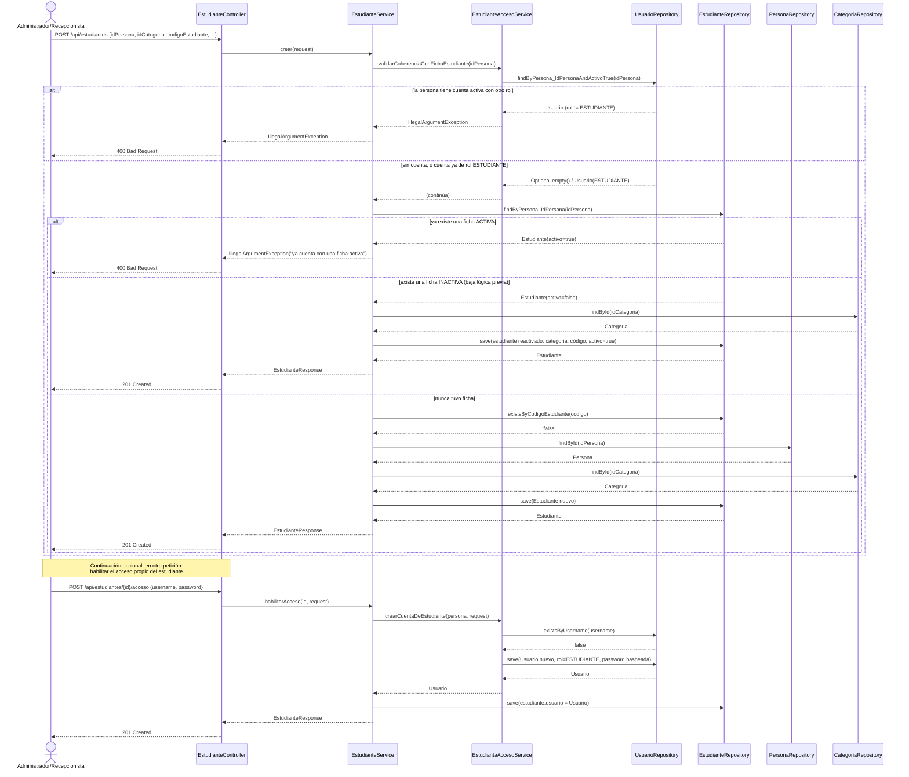
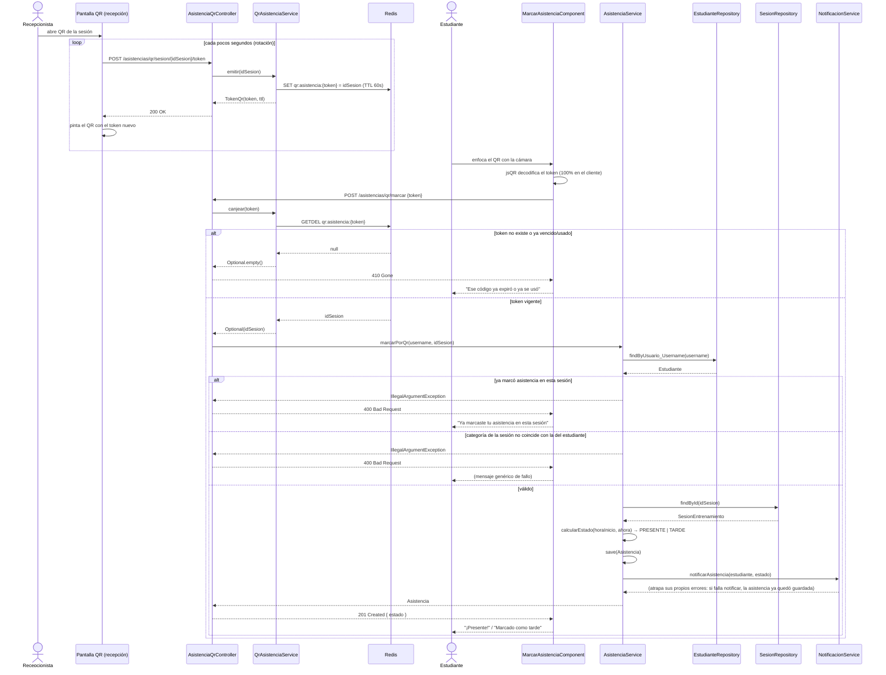

# Diagramas de secuencia

**Sistema:** SGED — Escuela Deportiva ProFútbol
**Notación:** Mermaid `sequenceDiagram` (misma notación que
`docs/requisitos/casos-uso.md`, versionable como texto y revisable en un
pull request).

Resuelve D-01 (informe de evaluación de calidad): el repositorio no tenía
ningún diagrama de secuencia, y el comportamiento dinámico solo estaba
descrito en prosa dentro de los flujos de `docs/requisitos/casos-uso.md`.

Se documentan los tres flujos que sugiere R-01 por ser, además, los tres
puntos de mayor complejidad medida del sistema (Tabla 14 del informe):
autenticación con JWT en cookie `HttpOnly` (CU-01), alta de estudiante
(`EstudianteService::crear`) y registro de asistencia por código QR
(`QrAsistenciaService`).

Cada diagrama refleja el código tal como quedó después del plan de
corrección de este mismo informe (`AuthController`/`AuthService`
divididos por R-03; `EstudianteAccesoService` extraído por R-06), no un
estado anterior.

---

## 1. Autenticación con JWT en cookie HttpOnly (CU-01)

El token nunca aparece en el cuerpo de la respuesta ni en un header
legible por JavaScript: viaja únicamente en una cookie `HttpOnly` +
`Secure` + `SameSite=Strict` que fija el propio backend (ADR-002,
ADR-008).

---

## 2. Alta de estudiante (`EstudianteService::crear`)

`crear()` da de alta o reactiva la **ficha** de estudiante sobre una
`Persona` que ya existe; no crea la cuenta de acceso. Habilitar el
acceso propio (para que el estudiante marque su QR) es un paso aparte,
`POST /api/estudiantes/{id}/acceso`, mostrado al final como
continuación — así es como lo usa la pantalla de Personas del
administrador (`FichaEstudianteComponent` da de alta la ficha;
`CuentaUsuarioComponent`/el botón de acceso crean la cuenta después,
solo si se pide).

---

## 3. Registro de asistencia por código QR

Dos roles con permisos distintos: **recepción** emite el token
(`ADMINISTRADOR`/`RECEPCIONISTA`), **el estudiante** lo canjea desde su
propia sesión autenticada. El QR nunca contiene datos personales, solo
un identificador opaco con vencimiento corto en Redis (ver
`QrAsistenciaService`).

