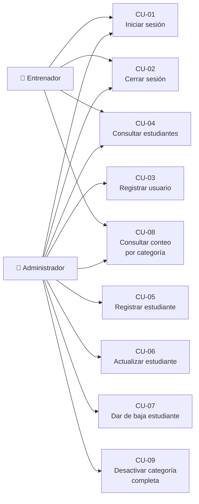

# Casos de uso

**Sistema:** SGED — Escuela Deportiva ProFútbol
**Notación:** casos de uso expandidos (Cockburn), con flujo principal y
flujos alternativos.

Actores: **Administrador** (`ADMINISTRADOR`), **Entrenador** (`ENTRENADOR`),
**Sistema** (procesos automáticos).

---

## Diagrama de casos de uso

---

## CU-01 — Iniciar sesión

| Campo | Valor |
|---|---|
| **Identificador** | CU-01 |
| **Actor principal** | Administrador, Entrenador, Usuario estándar |
| **Requisitos** | RF-02, RF-06 |
| **Precondición** | El usuario existe y está activo en `seguridad.usuarios`. |
| **Postcondición** | El navegador posee una cookie de sesión válida. |
| **Endpoint** | `POST /api/auth/login` |

**Flujo principal**
1. El actor introduce su nombre de usuario y contraseña.
2. El sistema verifica que la cuenta no esté bloqueada por intentos fallidos.
3. El sistema compara la contraseña contra el hash BCrypt almacenado.
4. El sistema genera un JWT firmado con emisor, audiencia, `jti` y `nbf`.
5. El sistema devuelve el token **únicamente** en una cookie `HttpOnly`,
   `Secure`, `SameSite=Strict`.
6. El sistema borra el contador de intentos fallidos del usuario.
7. El sistema registra el evento de autenticación exitosa con IP y sujeto.

**Flujos alternativos**
- **3a. Contraseña incorrecta.** El sistema incrementa el contador de
  intentos fallidos, registra el fallo en el log de auditoría y devuelve un
  error genérico que no revela si el usuario existe.
- **2a. Cuenta bloqueada.** Tras 5 fallos en 15 minutos, el sistema devuelve
  `429 Too Many Requests` con cuerpo `ProblemDetail` y no evalúa la
  contraseña.

---

## CU-02 — Cerrar sesión

| Campo | Valor |
|---|---|
| **Identificador** | CU-02 |
| **Actor principal** | Cualquier usuario autenticado |
| **Requisitos** | RF-03 |
| **Precondición** | Existe una sesión activa. |
| **Postcondición** | El token queda revocado y la cookie eliminada. |
| **Endpoint** | `POST /api/auth/logout` |

**Flujo principal**
1. El actor solicita cerrar la sesión.
2. El sistema extrae el `jti` y el tiempo de vida restante del token.
3. El sistema registra el `jti` en la lista de revocación de Redis con
   expiración igual al tiempo restante.
4. El sistema elimina la cookie de sesión del navegador.
5. El sistema responde `204 No Content`.

**Flujos alternativos**
- **2a. Token ya expirado.** Si el tiempo restante no es positivo, el sistema
  omite el registro en la lista de revocación (no tiene sentido revocar algo
  ya vencido) y continúa con el paso 4.
- **Posterior.** Cualquier petición que vuelva a presentar ese token es
  rechazada aunque su firma siga siendo criptográficamente válida.

---

## CU-03 — Registrar usuario

| Campo | Valor |
|---|---|
| **Identificador** | CU-03 |
| **Actor principal** | Administrador |
| **Requisitos** | RF-01 |
| **Precondición** | El actor tiene sesión activa con rol `ADMINISTRADOR`. |
| **Postcondición** | Existe una nueva cuenta con su persona y rol asociados. |
| **Endpoint** | `POST /api/auth/registro` |

**Flujo principal**
1. El administrador envía los datos de la nueva cuenta.
2. El sistema verifica que el nombre de usuario no esté en uso.
3. El sistema cifra la contraseña con BCrypt (coste 12).
4. El sistema crea la persona, el usuario y su asignación de rol.
5. El sistema responde con la cuenta creada.

**Flujos alternativos**
- **1a. Actor no autenticado.** El sistema responde `401`.
- **1b. Actor sin rol ADMINISTRADOR.** El sistema responde `403`. *(Este
  endpoint estuvo abierto y fue cerrado explícitamente; ver OBS-07.)*
- **2a. Usuario duplicado.** El sistema rechaza la operación e informa el
  conflicto.

---

## CU-04 — Consultar estudiantes

| Campo | Valor |
|---|---|
| **Identificador** | CU-04 |
| **Actor principal** | Administrador, Entrenador, Usuario estándar |
| **Requisitos** | RF-08, RF-09 |
| **Precondición** | Sesión activa con cualquiera de los tres roles. |
| **Endpoint** | `GET /api/estudiantes`, `GET /api/estudiantes/{id}` |

**Flujo principal**
1. El actor solicita el listado indicando página y tamaño.
2. El sistema consulta la caché de Redis; si hay resultado vigente (TTL 60 s)
   lo devuelve.
3. Si no hay caché, el sistema consulta la base de datos vía Spring Data JPA.
4. El sistema devuelve la página con `content`, `page`, `size`,
   `totalElements` y `totalPages`.

**Flujos alternativos**
- **1a. Sin sesión.** El sistema responde `401` con cuerpo `ProblemDetail`.
- **Variante por identificador.** Si el actor consulta un identificador
  inexistente, el sistema responde `404` con cuerpo `ProblemDetail`.

---

## CU-05 — Registrar estudiante

| Campo | Valor |
|---|---|
| **Identificador** | CU-05 |
| **Actor principal** | Administrador |
| **Requisitos** | RF-10, RF-11 |
| **Precondición** | Sesión activa con rol `ADMINISTRADOR`. |
| **Postcondición** | Existe el estudiante y su persona asociada. |
| **Endpoint** | `POST /api/estudiantes` |

**Flujo principal**
1. El administrador envía `idPersona`, `idCategoria`, `idEstadoGeneral`,
   `codigoEstudiante` y `fechaIngreso` (opcionalmente `peso`/`altura`).
2. El sistema valida que la persona, la categoría y el estado general
   referenciados existan.
3. El sistema crea el registro en `academico.estudiantes`.
4. El sistema invalida la caché del listado.
5. El sistema responde `201 Created` con el recurso.

**Flujos alternativos**
- **2a. Categoría, persona o estado inexistentes.** El sistema responde
  `422` con el campo y el motivo, sin persistir nada.
- **1a. Rol insuficiente.** El sistema responde `403`.

> **Corrección (2026-07-30):** este caso de uso describía nombre/apellido
> directos y una categoría de texto validada por patrón `SUB-NN`. Tras la
> reestructuración de paquetes, el estudiante referencia una `Persona` y una
> `Categoria` ya existentes por clave foránea — ver RF-10/RF-11 en el SRS.

---

## CU-06 — Actualizar estudiante

| Campo | Valor |
|---|---|
| **Identificador** | CU-06 |
| **Actor principal** | Administrador |
| **Requisitos** | RF-12 |
| **Endpoint** | `PUT /api/estudiantes/{id}` |

**Flujo principal**
1. El administrador envía los datos corregidos del estudiante.
2. El sistema verifica que el estudiante exista.
3. El sistema aplica las mismas validaciones que en el registro.
4. El sistema persiste los cambios; el disparador de base de datos actualiza
   automáticamente `actualizado_en`.
5. El sistema responde `200` con el recurso actualizado.

**Flujos alternativos**
- **2a. Estudiante inexistente.** El sistema responde `404`.
- **3a. Datos inválidos.** El sistema responde `422`.

---

## CU-07 — Dar de baja a un estudiante

| Campo | Valor |
|---|---|
| **Identificador** | CU-07 |
| **Actor principal** | Administrador |
| **Requisitos** | RF-13 |
| **Postcondición** | El estudiante queda inactivo, **sin** borrado físico. |
| **Endpoint** | `DELETE /api/estudiantes/{id}` |

**Flujo principal**
1. El administrador solicita la baja del estudiante.
2. El sistema verifica que exista.
3. El sistema marca `activo = FALSE` conservando todo el registro.
4. El sistema responde `204 No Content`.

**Flujos alternativos**
- **2a. Estudiante inexistente.** El sistema responde `404`.

**Regla de negocio.** La baja es lógica para preservar el historial deportivo
(asistencias y evaluaciones referencian al estudiante mediante clave
foránea).

---

## CU-08 — Consultar conteo de activos por categoría

| Campo | Valor |
|---|---|
| **Identificador** | CU-08 |
| **Actor principal** | Administrador, Entrenador |
| **Requisitos** | RF-14 |
| **Endpoint** | `GET /api/estudiantes/conteo/{categoria}` |

**Flujo principal**
1. El actor indica la categoría a consultar.
2. El sistema invoca el procedimiento almacenado
   `seguridad.sp_contar_estudiantes_activos` mediante `@Procedure`.
3. El motor de base de datos calcula la agregación y devuelve el total.
4. El sistema responde con el número de estudiantes activos.

**Regla de diseño.** La agregación se ejecuta en el motor por exigencia
arquitectónica (RD-02): la aplicación no recorre registros para contar.

---

## CU-09 — Desactivar una categoría completa

| Campo | Valor |
|---|---|
| **Identificador** | CU-09 |
| **Actor principal** | Administrador |
| **Requisitos** | RF-15 |
| **Precondición** | Sesión activa con rol `ADMINISTRADOR`. |
| **Postcondición** | Todos los estudiantes activos de la categoría quedan inactivos. |
| **Endpoint** | `POST /api/estudiantes/operaciones/desactivar-categoria` |

**Flujo principal**
1. El administrador indica la categoría a cerrar.
2. El sistema invoca el procedimiento almacenado
   `seguridad.sp_desactivar_estudiantes_categoria`.
3. El motor aplica la actualización masiva en una sola transacción y devuelve
   el número de filas afectadas.
4. El sistema responde con la cantidad de estudiantes desactivados.

**Flujos alternativos**
- **2a. Categoría sin estudiantes activos.** El sistema responde con `0`
  registros afectados; no es un error.
- **3a. Fallo durante la operación.** La transacción se revierte por
  completo; ningún estudiante queda parcialmente modificado.

---

## Casos de uso pendientes 🟡

Los siguientes casos de uso tienen su modelo de datos migrado
(`V3__dominio_deportivo.sql`, `V4__evaluaciones.sql`) pero **no cuentan con
API REST**, por lo que no se especifican en detalle en esta entrega:

| ID | Caso de uso | Requisito | Actor |
|---|---|---|---|
| CU-10 | Gestionar entrenadores | RF-16 | Administrador |
| CU-11 | Programar horarios de entrenamiento | RF-17 | Entrenador |
| CU-12 | Gestionar sesiones de entrenamiento | RF-18 | Entrenador |
| CU-13 | Registrar asistencia (RFID / manual) | RF-19 | Entrenador |
| CU-14 | Evaluar desempeño diario | RF-20, RF-21 | Entrenador |
| CU-15 | Notificar al representante | RF-22 | Sistema |
